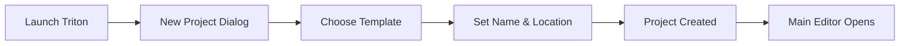
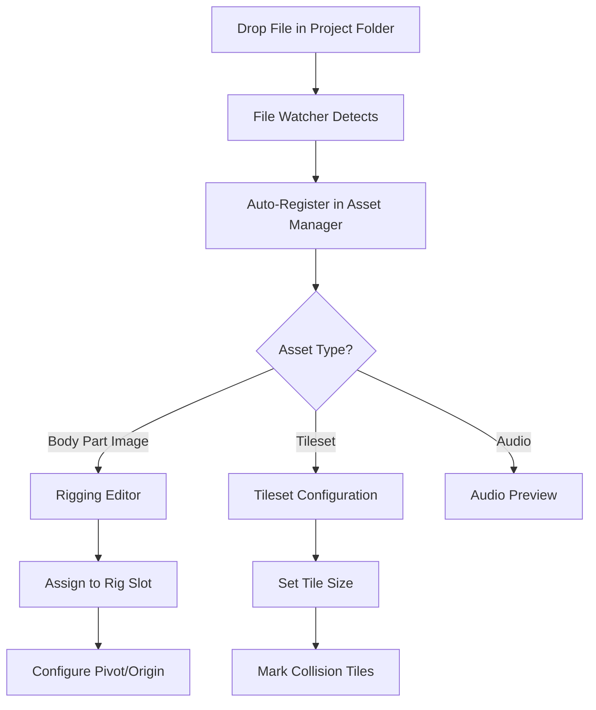
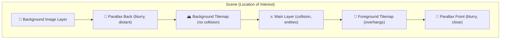
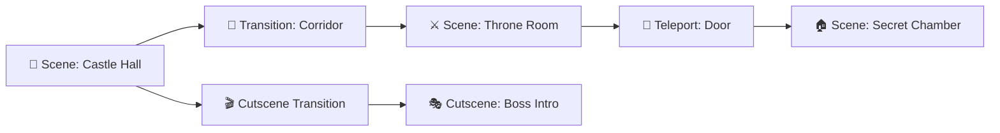
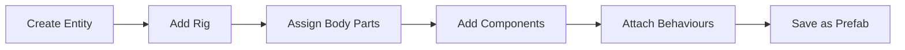
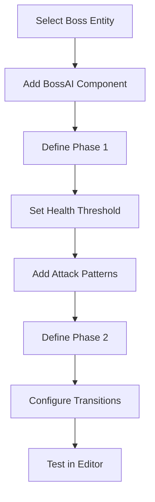
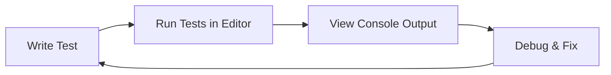
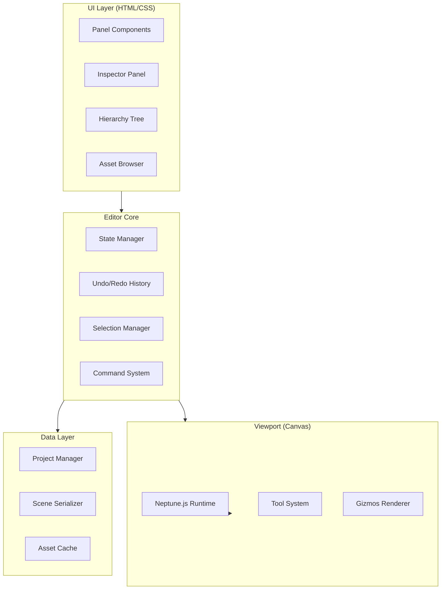

# Triton Editor - Software Requirements Specification (SRS)

> **Neptune.js Visual Game Editor for Metroidvania-Style 2D Platformers**

---

> **Neptune.js Visual Game Editor for Metroidvania-Style 2D Platformers**

---

## 0. DEEP RETROSPECTIVE & FAILURE ANALYSIS (Jan 2026)

### 0.1 The "Two Days of Garbage" Analysis
We spent ~48 hours spinning wheels. Here is *exactly* why:

#### 1. The "Aesthetic Trap" (Priority Failure)
- **Mistake**: We obsessed over "Vercel-style" & "High-End UI" (gradients, blurs) before ensuring the **rendering engine (Tailwind)** was even working.
- **Result**: We delivered beautiful React components that rendered as broken HTML because `tailwind.config.js` was missing.
- **Correction**: **Structure > Style**. Never write a single CSS class until the build system proves it can process it.

#### 2. The "Mock Data" Deception (integrity Failure)
- **Mistake**: The `AssetsPanel` used hardcoded an array of fake files (`player.png`, `jump.wav`) to "show progress".
- **Result**: The editor looked functional but was effectively a screenshot. The user (Rightfully) called this out as "garbage".
- **Correction**: **Zero Tolerance for Mocks**. If the Requirement is "File Browser", we implement `fs.readdir`. If we can't do it yet, we don't build the UI yet.

#### 3. The "Happy Path" Bias (Testing Failure)
- **Mistake**: I assumed `npm run build` would just work. I assumed `electron .` would load the demo.
- **Result**: The user had to report basic crashes and "white screens" because I didn't run the verification commands myself.
- **Correction**: **Trust No Code**. Every step (even config changes) acts as a checkpoint. I must run the build before notifying the user.

#### 4. The "Feature Vomit" (Scope Failure)
- **Mistake**: Tried to build "Welcome Screen" + "Inspector" + "Assets" + "Console" all at once.
- **Result**: A wide ocean of shallow, broken components.
- **Correction**: **Atomic Implementation**. Build *one* panel. Make it read real data. Make it look perfect. Then move to the next.

---

## 1. Introduction


---

## 1. Introduction


### 1.1 Purpose
Triton is a **desktop application** (Electron-based) visual editor for the Neptune.js game engine, designed to streamline the creation of **metroidvania-style 2D side-scrolling platformers** like Hollow Knight, Super Mario, and similar A-RPG games.

### 1.2 Scope
Triton Editor enables developers to:
- Create and manage game projects with live file system watching
- Design large, interconnected worlds with **multi-layer scenes**
- Configure player, NPC, enemy, and boss entities with **rigged body parts**
- Define multi-phase boss AI behaviors
- Author dialogue and story cutscenes
- Configure RPG mechanics (stats, inventory, quests)
- Provide customizable **HTML/CSS UI templates** (splash, menus, HUD)
- Run tests and view console output within the editor
- Export playable game builds

### 1.3 Key Design Decisions

> [!IMPORTANT]
> **Desktop App**: Triton runs as Electron desktop app for native file system access. Dropping files into the project folder auto-registers them in the Asset Manager.

> [!IMPORTANT]
> **Rigging, Not Spritesheets**: Characters are rigged from body part images (head, torso, arms, legs). No spritesheet slicing—all animations are skeletal via the Titan system.

> [!IMPORTANT]
> **HTML/CSS UI System**: In-game UI (menus, HUD) is HTML/CSS-based, not canvas-rendered. Users customize via CSS. The engine's `src/ui` canvas components will be removed.

### 1.4 Target Engine Capabilities

| Subsystem | Components | Purpose |
|-----------|------------|----------|
| **Core** | Entity, Scene, SceneManager, Storage | ECS architecture, scene management |
| **Titan** | Animator, Animation, Rig, Pose | Skeletal rigging & animation |
| **Thalassa** | Camera, Tilemap, Tileset, Parallax | World rendering, layers |
| **Nereid** | Body, Collider, PlatformerController | Physics, platformer controls |
| **Larissa** | Stats, Inventory, BossAI | RPG mechanics, boss encounters |
| **Galatea** | Cutscene, CutsceneManager, DialogueBox | Story and dialogue system |
| **Proteus** | Sound, Music | Audio playback |

---

## 2. User Personas

### 2.1 Indie Developer ("Alex")
- **Background**: Solo developer with programming experience, building first commercial game
- **Goals**: Quickly prototype levels, iterate on boss fights, focus on gameplay polish
- **Pain Points**: Context switching between code and visual design, repetitive entity setup
- **Key Needs**: Fast iteration, visual feedback, code-free configuration where possible

### 2.2 Game Designer ("Sam")
- **Background**: Design-focused creator with limited coding experience
- **Goals**: Create compelling levels, design enemy encounters, craft narrative
- **Pain Points**: Debugging code, understanding technical systems
- **Key Needs**: Visual tools for all design work, preview without code changes

### 2.3 Pixel Artist ("Jordan")
- **Background**: Artist contributing assets to a team project
- **Goals**: Import spritesheets, preview animations in-engine, setup tilesets
- **Pain Points**: Handoff friction with developers, asset pipeline complexity
- **Key Needs**: Quick asset import, visual animation preview, tileset auto-slicing

### 2.4 Narrative Designer ("Casey")
- **Background**: Writer handling story, dialogue, and cutscenes
- **Goals**: Author NPC dialogue trees, script story cutscenes, test flow
- **Pain Points**: Testing dialogue requires code changes, branching complexity
- **Key Needs**: Visual dialogue editor, cutscene timeline, in-editor preview

### 2.5 Hobbyist ("Taylor")
- **Background**: Beginner learning game development
- **Goals**: Create a simple metroidvania, learn engine concepts
- **Pain Points**: Overwhelming complexity, lack of guidance
- **Key Needs**: Templates, tooltips, progressive disclosure of features

---

## 3. User Workflows

### 3.1 Project Creation Workflow



**Steps:**
1. User launches Triton Editor
2. Welcome screen offers: New Project / Open Recent / Open Folder
3. New Project wizard:
   - Choose template (Empty, Basic Platformer, Metroidvania Starter)
   - Set project name and directory
   - Configure initial settings (resolution, target FPS)
4. Project structure created:
   ```
   my-game/
   ├── project.triton        # Project config
   ├── assets/
   │   ├── sprites/
   │   ├── tilesets/
   │   ├── audio/
   │   └── fonts/
   ├── scenes/
   │   └── main.scene
   ├── entities/
   │   └── prefabs/
   ├── scripts/
   └── exports/
   ```
5. Main editor opens with default scene

---

### 3.2 Asset Import Workflow (Jordan - Artist)



**Asset Discovery:**
- Triton watches the project folder for file changes
- New files automatically appear in Asset Browser
- No manual import step required

**For Character Body Parts (Rigging):**
1. Drop body part PNGs into `assets/characters/[name]/`
2. Open Rig Editor for character
3. Assign images to rig slots:
   - Head, Torso, Left Arm, Right Arm, Left Leg, Right Leg, etc.
4. Configure per-part:
   - Pivot point (rotation origin)
   - Z-order (layering)
   - Bone attachments
5. Create Poses (keyframes with part transforms)
6. Create Animations (sequences of poses)

**For Tilesets:**
1. Drop tileset image into `assets/tilesets/`
2. Configure tile size (e.g., 16×16, 32×32)
3. Mark tile properties:
   - Solid (full collision)
   - Platform (one-way)
   - Ladder (climbable)
   - Hazard (damage)
4. Save as Tileset Resource

---

### 3.3 Scene & Layer Architecture



**Layer Types:**

| Layer | Purpose | Collision |
|-------|---------|----------|
| Background Image | Static backdrop (sky, distant mountains) | No |
| Parallax Back | Blurry distant elements, slow scroll | No |
| Background Tiles | Cave walls, decorative tiles | No |
| **Main Layer** | Player, enemies, platforms, interactables | **Yes** |
| Foreground Tiles | Overhangs, vines above player | No |
| Parallax Front | Blurry close elements, fast scroll | No |

**Main Layer Options:**
- **Tilemap Mode**: Grid-based tiles with collision
- **Free-Form Mode**: Place platforms anywhere (Hollow Knight style)
- **Hybrid**: Mix of both

### 3.4 Scene vs Transition System



| Type | Purpose | Loading |
|------|---------|----------|
| **Scene** | Location of interest (gameplay, bosses, NPCs) | Fully loaded |
| **Transition** | Low-interest path connecting scenes | Triggers dynamic loading |
| **Teleport** | Instant scene change (doors, indoor/outdoor) | Loading screen optional |
| **Cutscene** | Non-interactive story moment | Treated as scene |

**Dynamic Loading:**
- Player enters Transition → Next Scene loads in background
- No loading screens during normal exploration
- Teleports can show brief fade/loading if needed

---

### 3.5 Level Design Workflow

**Steps:**
1. Create/open Scene
2. Configure layer stack (add/remove layers)
3. **Main Layer editing:**
   - Tilemap mode: Paint tiles with brush tools
   - Free-form mode: Place platform entities anywhere
4. Place entities from prefab library
5. Configure parallax layer scroll speeds
6. Set camera bounds
7. Add Transition zones to connect scenes

---

### 3.6 Entity Configuration Workflow



**For Player Entity:**
1. Create new Entity named "Player"
2. Add `Rig` component → opens Rig Editor
3. Assign body part images (head, torso, arms, legs)
4. Add components via Inspector:
   - `Transform` - position, rotation, scale
   - `Animator` - create/assign animations
   - `PlatformerController` - jump height, speed
   - `Collider` - hitbox shape
   - `Stats` - health, stamina
   - `Inventory` - slot count
5. Attach custom Behaviour scripts
6. Save as Prefab for reuse

**For Enemy/NPC:**
- Same flow + AI component with state machine editor

---

### 3.7 Boss AI Configuration Workflow



**Steps:**
1. Create Boss Entity with Rig, Stats, Animator, Collider
2. Add `BossAI` component
3. Visual Phase Editor:
   - Phase 1: 100%-70% health → Patterns A, B, C
   - Phase 2: 70%-30% health → Faster patterns
   - Phase 3: 30%-0% health → Rage mode
4. Configure per-phase: threshold, timing, transitions
5. Link attack patterns to rig animations
6. **Test fight in editor** with debug overlays

---

### 3.8 Dialogue & Cutscene Workflow

**Dialogue System:**
- Node-based dialogue graph editor
- Nodes: Start → Lines → Choices → Conditions → Actions → End
- Preview with typewriter effect

**Cutscene System:**
- Cutscenes are **Scenes** with teleport-like transitions
- Timeline editor: Camera, Entity, Dialogue, Audio, Fade tracks
- Played as non-interactive moment, returns to gameplay scene

### 3.9 In-Editor Testing Workflow



**Features:**
- Run Neptune.js tests directly in editor
- Console panel shows test output, logs, errors
- Filter by log level (info, warn, error)
- Click stack traces to jump to code

---

### 3.10 Game Export Workflow

**Steps:**
1. Open Build Settings
2. Select target: Web (HTML5) or Desktop (Electron)
3. Configure: Entry scene, assets, UI theme CSS
4. Build → Auto-launch for testing
5. Package for distribution

**UI System Export:**
- HTML/CSS UI templates bundled with game
- Users customize `styles/ui-theme.css` for look & feel
- Default templates: Splash, Main Menu, Pause, Settings, HUD

---

## 4. Functional Requirements

### 4.1 Project Management

| ID | Requirement | Priority |
|----|-------------|----------|
| PM-01 | Create new project from template | Must |
| PM-02 | Open existing project folder | Must |
| PM-03 | Recent projects list | Should |
| PM-04 | Project settings configuration | Must |
| PM-05 | Auto-save with undo history | Should |

### 4.2 Asset Management

| ID | Requirement | Priority |
|----|-------------|----------|
| AM-01 | File system watcher for auto-discovery | Must |
| AM-02 | Asset browser with folder navigation | Must |
| AM-03 | Body part image import for rigging | Must |
| AM-04 | Tileset configuration with collision marking | Must |
| AM-05 | Animation preview player | Must |
| AM-06 | Audio preview with waveform | Should |
| AM-07 | Hot-reload on file changes | Should |

### 4.3 Scene Editor

| ID | Requirement | Priority |
|----|-------------|----------|
| SE-01 | Canvas viewport with pan/zoom | Must |
| SE-02 | Entity hierarchy tree panel | Must |
| SE-03 | Inspector panel for component editing | Must |
| SE-04 | Scene save/load in JSON format | Must |
| SE-05 | Multi-layer scene architecture | Must |
| SE-06 | Scene vs Transition designation | Must |
| SE-07 | Teleport transition placement | Must |
| SE-08 | Cutscene scene creation | Should |
| SE-09 | Undo/Redo for all operations | Must |

### 4.4 Tilemap Editor

| ID | Requirement | Priority |
|----|-------------|----------|
| TM-01 | Tile brush tool (single & multi-tile) | Must |
| TM-02 | Rectangle fill tool | Must |
| TM-03 | Bucket fill tool | Should |
| TM-04 | Eraser tool | Must |
| TM-05 | Tile picker (eyedropper) | Must |
| TM-06 | Multiple tilemap layers | Must |
| TM-07 | Layer visibility toggle | Must |
| TM-08 | Auto-tile rules | Could |
| TM-09 | Tile collision auto-generation | Should |

### 4.5 Entity System

| ID | Requirement | Priority |
|----|-------------|----------|
| ES-01 | Create/delete entities | Must |
| ES-02 | Entity parent-child hierarchy | Must |
| ES-03 | Add/remove components to entities | Must |
| ES-04 | Component property editing in Inspector | Must |
| ES-05 | Entity prefab save/instantiate | Must |
| ES-06 | Entity copy/paste/duplicate | Should |
| ES-07 | Entity search and filter | Should |

### 4.6 Component Editors

| ID | Requirement | Priority |
|----|-------------|----------|
| CE-01 | Transform gizmos (move, rotate, scale) | Must |
| CE-02 | Rig editor with body part assignment | Must |
| CE-03 | Collider shape visual editor | Must |
| CE-04 | PlatformerController parameter tuning | Should |
| CE-05 | Stats component with visual sliders | Should |
| CE-06 | Inventory slot configuration | Should |

### 4.7 Animation System (Rigging)

| ID | Requirement | Priority |
|----|-------------|----------|
| AN-01 | Rig editor: assign body parts to slots | Must |
| AN-02 | Pose editor: keyframe part transforms | Must |
| AN-03 | Animation editor: sequence poses | Must |
| AN-04 | Animation preview with scrubbing | Must |
| AN-05 | Animator state machine graph | Should |
| AN-06 | Pivot/origin configuration per part | Must |

### 4.8 Boss AI Editor

| ID | Requirement | Priority |
|----|-------------|----------|
| BA-01 | Phase configuration panel | Must |
| BA-02 | Attack pattern assignment | Must |
| BA-03 | Health threshold configuration | Must |
| BA-04 | Visual state machine for AI states | Should |
| BA-05 | In-editor boss fight testing | Should |

### 4.9 Dialogue & Cutscene

| ID | Requirement | Priority |
|----|-------------|----------|
| DC-01 | Node-based dialogue graph editor | Must |
| DC-02 | Dialogue line editing (speaker, text, portrait) | Must |
| DC-03 | Choice/branching nodes | Should |
| DC-04 | Condition nodes (inventory checks, flags) | Should |
| DC-05 | Cutscene timeline editor | Should |
| DC-06 | Cutscene preview playback | Should |
| DC-07 | Typewriter effect preview | Should |

### 4.10 Parallax & Camera

| ID | Requirement | Priority |
|----|-------------|----------|
| PC-01 | Parallax layer configuration | Should |
| PC-02 | Camera bounds definition | Must |
| PC-03 | Camera follow target selection | Should |
| PC-04 | Transition zone placement | Should |

### 4.11 Audio

| ID | Requirement | Priority |
|----|-------------|----------|
| AU-01 | Sound/Music asset management | Must |
| AU-02 | Audio preview in editor | Should |
| AU-03 | Volume/loop configuration | Should |

### 4.12 Build & Export

| ID | Requirement | Priority |
|----|-------------|----------|
| BE-01 | Web (HTML5) export | Must |
| BE-02 | Desktop (Electron) export | Should |
| BE-03 | Build configuration UI | Must |
| BE-04 | Auto-bundle assets | Must |
| BE-05 | Bundle HTML/CSS UI templates | Must |
| BE-06 | One-click test launch | Must |
| BE-07 | Build asset optimization | Should |

### 4.13 In-Editor Testing

| ID | Requirement | Priority |
|----|-------------|----------|
| TE-01 | Run Neptune.js tests in editor | Must |
| TE-02 | Console panel for test output | Must |
| TE-03 | Log level filtering | Should |
| TE-04 | Click-to-source from stack traces | Should |

### 4.14 UI System

| ID | Requirement | Priority |
|----|-------------|----------|
| UI-01 | HTML/CSS UI templates (splash, menu, HUD) | Must |
| UI-02 | CSS theming for customization | Must |
| UI-03 | Live preview of UI changes | Should |
| UI-04 | Remove canvas-based UI (src/ui) | Must |

### 4.15 Editor Usability

| ID | Requirement | Priority |
|----|-------------|----------|
| EU-01 | Keyboard shortcuts | Must |
| EU-02 | Panel layout customization | Should |
| EU-03 | Dark theme | Must |
| EU-04 | Tooltips and help text | Must |
| EU-05 | Search across project | Should |

### 4.16 Demo Application

| ID | Requirement | Priority |
|----|-------------|----------|
| DA-01 | Built-in demo project accessible from menu | Must |
| DA-02 | Demo showcases all engine features | Must |
| DA-03 | Demo serves as learning reference | Must |
| DA-04 | Demo usable for regression testing | Must |

---

## 5. Non-Functional Requirements

### 5.1 Performance
- Editor should handle scenes with 500+ entities smoothly
- Tilemap editing responsive for maps up to 1000×1000 tiles
- Asset browser should index 10,000+ files without lag

### 5.2 Platform
- **Desktop App**: Electron-based for native file system access
- Neptune.js v3.3.1+ compatibility
- Cross-platform: Windows, macOS, Linux
- Export targets: Web (HTML5), Desktop (Electron)

### 5.3 Usability
- First-time users can create a simple level within 15 minutes
- Core workflows achievable without documentation reference
- Progressive disclosure of advanced features

### 5.4 Extensibility
- Plugin architecture for custom component editors
- Custom tool registration API
- Script integration points

---

## 6. Technical Architecture Overview

### 6.1 Proposed Architecture



### 6.2 Technology Stack
- **Editor App**: Electron (Node.js + Chromium)
- **UI**: HTML/CSS panels + Canvas viewport
- **Viewport**: Neptune.js canvas with editor overlays
- **File Watching**: chokidar for live asset discovery
- **Data Format**: JSON for all project data
- **Build Tool**: Vite for export bundling

---

## 7. Project File Formats

### 7.1 Project Configuration (`project.triton`)
```json
{
  "name": "My Metroidvania",
  "version": "1.0.0",
  "neptuneVersion": "3.3.1",
  "resolution": { "width": 1920, "height": 1080 },
  "uiTheme": "styles/ui-theme.css",
  "entryScene": "scenes/main.scene"
}
```

### 7.2 Scene Format (`*.scene`)
```json
{
  "name": "CastleHall",
  "type": "scene",
  "layers": [
    { "type": "background-image", "src": "assets/bg/castle-sky.png" },
    { "type": "parallax", "depth": "back", "blur": 2, "scrollSpeed": 0.3 },
    { "type": "tilemap", "collision": false, "data": "..." },
    { "type": "main", "mode": "freeform", "entities": [...] },
    { "type": "tilemap", "collision": false, "data": "..." },
    { "type": "parallax", "depth": "front", "blur": 1, "scrollSpeed": 1.2 }
  ],
  "transitions": [
    { "id": "to-corridor", "type": "walk", "target": "Corridor.scene", "position": {...} },
    { "id": "to-secret", "type": "teleport", "target": "SecretRoom.scene" }
  ],
  "camera": { "bounds": {...} }
}
```

### 7.3 Dialogue Format (`*.dialogue`)
```json
{
  "id": "npc_elder_intro",
  "nodes": [
    { "id": "start", "type": "line", "speaker": "Elder", "text": "Welcome, traveler...", "next": "choice1" },
    { "id": "choice1", "type": "choice", "options": [
      { "text": "Tell me about the darkness", "next": "darkness" },
      { "text": "I must go", "next": "end" }
    ]}
  ]
}
```

---

## 8. Engine Modifications Required

> [!WARNING]
> The following Neptune.js changes are needed:

1. **Remove `src/ui/`**: Canvas UI replaced by HTML/CSS UI system
2. **Enhance Titan**: Ensure Rig supports external body part images
3. **Scene Layers**: Add multi-layer support to Scene/SceneManager
4. **Dynamic Loading**: Add scene preloading for transition system

---

## 9. MVP Scope (Phase 1)

1. **Desktop App**: Electron shell with file watching
2. **Project Management**: New/open project, settings
3. **Asset Browser**: Auto-discovery, folder navigation
4. **Scene Editor**: Multi-layer viewport, entity hierarchy
5. **Rigging**: Body part import, rig editor, pose/animation creation
6. **Tilemap Editing**: Paint tools, collision marking
7. **Entity System**: Components, prefabs
8. **Console Panel**: Test output, logs
9. **Web Export**: Build and test

---

## 10. Approval Checklist

- [ ] Rigging system replaces spritesheets ✓
- [ ] Multi-layer scene architecture defined ✓
- [ ] Scene/Transition/Teleport system clear ✓
- [ ] In-editor testing with console ✓
- [ ] HTML/CSS UI system (remove canvas UI) ✓
- [ ] Desktop app with file watching ✓
- [ ] Workflows cover complete game creation lifecycle
- [ ] Requirements are complete and prioritized
- [ ] MVP scope is achievable

---

> **Next Steps**: Upon SRS approval, proceed to Technical Specification Document (TSD) detailing implementation architecture, component designs, and development phases.
