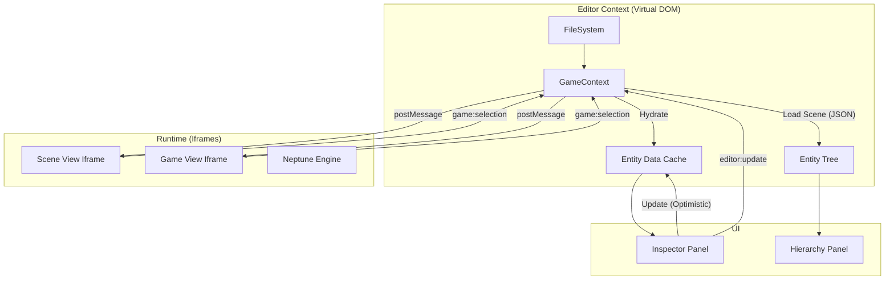
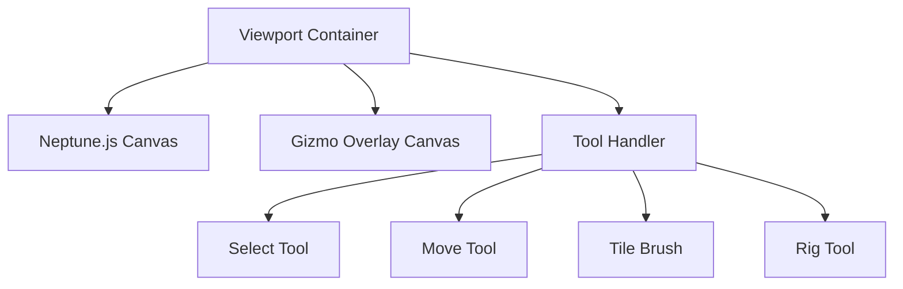
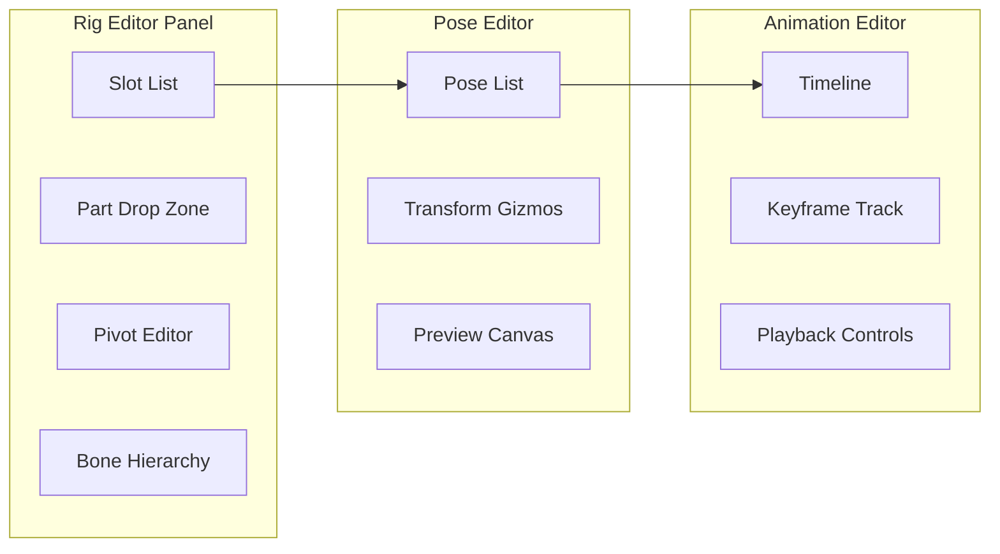

# Triton Editor - Technical Specification Document (TSD)

> **Implementation Architecture for Neptune.js Visual Game Editor**

---

## 1. Document Overview

### 1.1 Purpose
This Technical Specification Document (TSD) provides the detailed implementation blueprint for Triton Editor based on the approved SRS. It covers architecture, module designs, data structures, and development phases.

### 1.2 Reference Documents
- [Triton Editor SRS](file:///f:/Workspace/Neptune.js/static/triton_editor_srs.md)
- Neptune.js Engine Source (`src/`)

---

## 2. System Architecture

### 2.1 High-Level Architecture

```mermaid
graph TB
    subgraph TauriApp["Tauri App"]
        Core[Rust Core Process]
        WebView[WebView Process]
    end
    
    subgraph RustCore["Tauri Core (Rust)"]
        FileWatcher[File Watcher (notify)]
        ProjectIO[Project I/O (std::fs)]
        BuildSystem[Build System (cargo/vite)]
        CommandHandlers[Tauri Commands]
    end
    
    subgraph RendererProcess["Frontend (Webview)"]
        subgraph UI["UI Layer (HTML/CSS)"]
            MenuBar[Menu Bar]
            Panels[Panel System]
            Dialogs[Dialog System]
        end
        
        subgraph CoreJS["Editor Core (JS)"]
            StateManager[State Manager]
            SelectionManager[Selection Manager]
            HistoryManager[Undo/Redo]
            TauriInvoke[Tauri Invoke]
        end
        
        subgraph Viewport["Viewport"]
            Canvas[Neptune.js Canvas]
            GizmoRenderer[Gizmo Renderer]
            ToolSystem[Tool System]
        end
    end
    
    Core --> CommandHandlers
    CommandHandlers <--> WebView
    FileWatcher --> CommandHandlers
    ProjectIO --> CommandHandlers
    BuildSystem --> CommandHandlers
    TauriInvoke <--> CommandHandlers
```

### 2.2 Technology Stack

| Layer | Technology | Purpose |
|-------|------------|---------|
| Desktop Shell | **Tauri 2.0** | High-performance, secure desktop app |
| Core Process | **Rust** | File system, heavy lifting, window management |
| Renderer | Webview | UI rendering (OS native webview) |
| UI Framework | **React 18+** | Component-based UI |
| Styling | **Tailwind CSS 4.0** | Utility-first styling |
| Components | **Radix UI / Shadcn** | Accessible, unstyled primitives |
| Canvas Engine | Neptune.js | Game viewport |
| File Watching | **notify (Rust)** | Asset auto-discovery |
| Bundler | Vite | Frontend & Game export builds |
| Data Format | JSON | All project data |

---

## 3. Module Breakdown

### 3.1 Module Dependency Graph

### 3.1 Realistic Architecture (Feb 2026)

The Editor operates on a **Virtual DOM** principle. The `GameContext` holds the authoritative state of the world (loaded from disk), which is *pushed* to the Runtime Iframes.



### 3.1.1 The Bridge Protocol
The Editor communicates with the Runtime using a standardized message protocol over `window.postMessage`.

| Direction | Type | Payload | Use Case |
| :--- | :--- | :--- | :--- |
| **E -> G** | `editor:load-scene` | `{ path, data? }` | Force load a scene. |
| **E -> G** | `editor:update-component` | `{ id, component, data }` | Update a property (live). |
| **E -> G** | `editor:camera-update` | `{ x, y, zoom }` | Sync Editor Camera. |
| **E -> G** | `editor:select` | `{ ids }` | Sync selection from Tree. |
| **G -> E** | `game:ready` | `{}` | Runtime is initialized. |
| **G -> E** | `game:selection-changed` | `{ ids }` | User clicked an object. |
| **G -> E** | `game:hierarchy-update` | `{ entities }` | Runtime spawned/destroyed objects. |


### 3.2 Module Specifications

| Module | Responsibility | Key Classes |
|--------|----------------|-------------|
| **Core** | Application bootstrap, lifecycle | `TritonApp`, `Config` |
| **EventBus** | Inter-module communication | `EventBus`, `Event` |
| **StateManager** | Centralized state, reactivity | `StateManager`, `Store` |
| **ProjectManager** | Project CRUD, file structure | `Project`, `ProjectLoader` |
| **AssetManager** | Asset discovery, caching | `AssetWatcher`, `AssetCache` |
| **HistoryManager** | Undo/redo stack | `HistoryStack`, `Command` |
| **SceneEditor** | Viewport, entity manipulation | `SceneView`, `EntityHandle` |
| **RigEditor** | Body part rigging | `RigView`, `PartSlot` |
| **TilemapEditor** | Tile painting tools | `TileCanvas`, `TileBrush` |
| **DialogueEditor** | Node graph for dialogues | `DialogueGraph`, `DialogueNode` |
| **ConsolePanel** | Log output, test runner | `Console`, `TestRunner` |

---

## 4. Detailed Component Specifications

### 4.1 Core Process (`src-tauri/src/`)
#### 4.1.1 Entry Point (`main.rs`)
```rust
// Tauri main entry
#![cfg_attr(
  all(not(debug_assertions), target_os = "windows"),
  windows_subsystem = "windows"
)]

fn main() {
  tauri::Builder::default()
    .invoke_handler(tauri::generate_handler![
        greet,
        load_project,
        save_file,
        run_tests
    ])
    .run(tauri::generate_context!())
    .expect("error while running tauri application");
}
```

#### 4.1.2 File Watcher (`watcher.rs`)
```rust
use notify::{Watcher, RecursiveMode, Result};
// Implementation of generic file watcher sending events to frontend
```


---

### 4.2 Renderer Process (`renderer/`)

#### 4.2.1 Application Bootstrap (`App.tsx`)

```typescript
import { useEffect } from 'react';
import { invoke } from '@tauri-apps/api/tauri';
import { listen } from '@tauri-apps/api/event';

function App() {
  useEffect(() => {
    // Setup listeners
    const unlisten = listen('file-change', (event) => {
       console.log('File changed:', event.payload);
    });
    
    return () => {
       unlisten.then(f => f());
    };
  }, []);

  return (
    <div className="app-container">
       {/* Layout and Panels */}
    </div>
  );
}
```

#### 4.2.2 State Manager (`core/stateManager.js`)

```javascript
export class StateManager {
    constructor() {
        this.state = {
            project: null,
            currentScene: null,
            selectedEntities: [],
            tool: 'select',
            layers: []
        };
        this.listeners = new Map();
    }
    
    get(path) { /* Get nested state value */ }
    set(path, value) { /* Set and notify listeners */ }
    subscribe(path, callback) { /* Subscribe to state changes */ }
}
```

#### 4.2.3 Command System (`core/commandSystem.js`)

```javascript
export class Command {
    execute() { throw new Error('Not implemented'); }
    undo() { throw new Error('Not implemented'); }
}

export class MoveEntityCommand extends Command {
    constructor(entity, oldPos, newPos) {
        super();
        this.entity = entity;
        this.oldPos = oldPos;
        this.newPos = newPos;
    }
    
    execute() {
        this.entity.transform.position = this.newPos;
    }
    
    undo() {
        this.entity.transform.position = this.oldPos;
    }
}

export class HistoryManager {
    constructor(maxSize = 100) {
        this.undoStack = [];
        this.redoStack = [];
        this.maxSize = maxSize;
    }
    
    execute(command) {
        command.execute();
        this.undoStack.push(command);
        this.redoStack = [];
        if (this.undoStack.length > this.maxSize) {
            this.undoStack.shift();
        }
    }
    
    undo() {
        const command = this.undoStack.pop();
        if (command) {
            command.undo();
            this.redoStack.push(command);
        }
    }
    
    redo() {
        const command = this.redoStack.pop();
        if (command) {
            command.execute();
            this.undoStack.push(command);
        }
    }
}
```

---

### 4.3 Panel System (`ui/`)

#### 4.3.1 Panel Base Class

```javascript
export class Panel {
    constructor(id, title) {
        this.id = id;
        this.title = title;
        this.element = null;
        this.isVisible = true;
    }
    
    render() { /* Return HTML string */ }
    mount(container) { /* Attach to DOM */ }
    update() { /* Re-render contents */ }
    onShow() { /* Visibility callback */ }
    onHide() { /* Visibility callback */ }
}
```

#### 4.3.2 Key Panels

| Panel | File | Purpose |
|-------|------|---------|
| `HierarchyPanel` | `panels/hierarchy.js` | Entity tree view |
| `InspectorPanel` | `panels/inspector.js` | Component property editing |
| `AssetBrowserPanel` | `panels/assetBrowser.js` | File navigation |
| `ConsolePanel` | `panels/console.js` | Logs and test output |
| `TilesetPanel` | `panels/tileset.js` | Tile palette |
| `AnimationPanel` | `panels/animation.js` | Pose/animation timeline |

---

### 4.4 Viewport (`viewport/`)

#### 4.4.1 Viewport Structure



#### 4.4.2 Tool System

```javascript
export class Tool {
    constructor(viewport) {
        this.viewport = viewport;
        this.active = false;
    }
    
    activate() { this.active = true; }
    deactivate() { this.active = false; }
    
    onMouseDown(e) {}
    onMouseMove(e) {}
    onMouseUp(e) {}
    onKeyDown(e) {}
    render(ctx) {}
}

export class SelectTool extends Tool {
    onMouseDown(e) {
        const entity = this.viewport.pickEntity(e.x, e.y);
        if (entity) {
            this.viewport.state.set('selectedEntities', [entity]);
        }
    }
}

export class TileBrushTool extends Tool {
    constructor(viewport) {
        super(viewport);
        this.selectedTile = null;
        this.painting = false;
    }
    
    onMouseDown(e) {
        this.painting = true;
        this.paintAt(e.x, e.y);
    }
    
    onMouseMove(e) {
        if (this.painting) {
            this.paintAt(e.x, e.y);
        }
    }
    
    onMouseUp(e) {
        this.painting = false;
    }
    
    paintAt(x, y) {
        const tilemap = this.viewport.currentLayer;
        if (tilemap && this.selectedTile !== null) {
            const tilePos = tilemap.worldToTile(x, y);
            tilemap.setTile(tilePos.x, tilePos.y, this.selectedTile);
        }
    }
}
```

---

### 4.5 Scene Editor

#### 4.5.1 Multi-Layer Scene Structure

```javascript
export class SceneData {
    constructor() {
        this.name = '';
        this.type = 'scene'; // 'scene' | 'transition' | 'cutscene'
        this.layers = [];
        this.transitions = [];
        this.camera = { bounds: null };
    }
}

export class Layer {
    constructor(type) {
        this.type = type; // 'background-image' | 'parallax' | 'tilemap' | 'main'
        this.visible = true;
        this.locked = false;
    }
}

export class MainLayer extends Layer {
    constructor() {
        super('main');
        this.mode = 'freeform'; // 'tilemap' | 'freeform' | 'hybrid'
        this.entities = [];
    }
}

export class TilemapLayer extends Layer {
    constructor() {
        super('tilemap');
        this.tileset = null;
        this.width = 0;
        this.height = 0;
        this.data = [];
        this.collision = false;
    }
}

export class ParallaxLayer extends Layer {
    constructor() {
        super('parallax');
        this.depth = 'back'; // 'back' | 'front'
        this.blur = 0;
        this.scrollSpeed = 0.5;
        this.image = null;
    }
}
```

---

### 4.6 Rig Editor

#### 4.6.1 Rig Data Structure

```javascript
export class RigData {
    constructor() {
        this.slots = new Map(); // slotName -> PartSlot
        this.bones = [];
        this.poses = new Map(); // poseName -> Pose
        this.animations = new Map(); // animName -> Animation
    }
}

export class PartSlot {
    constructor(name) {
        this.name = name;
        this.imagePath = null;
        this.pivot = { x: 0.5, y: 0.5 }; // Normalized 0-1
        this.zOrder = 0;
        this.parentBone = null;
    }
}

export class Pose {
    constructor(name) {
        this.name = name;
        this.partTransforms = new Map(); // slotName -> { x, y, rotation, scaleX, scaleY }
    }
}

export class RigAnimation {
    constructor(name) {
        this.name = name;
        this.duration = 1.0;
        this.loop = true;
        this.keyframes = []; // { time: number, poseName: string }
    }
}
```

#### 4.6.2 Rig Editor UI



---

### 4.7 Console & Test Runner

#### 4.7.1 Console Panel

```javascript
export class ConsolePanel extends Panel {
    constructor() {
        super('console', 'Console');
        this.logs = [];
        this.filter = 'all'; // 'all' | 'info' | 'warn' | 'error'
    }
    
    log(level, message, source) {
        this.logs.push({ level, message, source, time: Date.now() });
        this.update();
    }
    
    async runTests() {
        this.log('info', 'Running tests...', 'TestRunner');
        await invoke('run_tests');
    }
    
    render() {
        return `
            <div class="console-panel">
                <div class="console-toolbar">
                    <button onclick="console.clear()">Clear</button>
                    <button onclick="console.runTests()">Run Tests</button>
                    <select onchange="console.setFilter(this.value)">
                        <option value="all">All</option>
                        <option value="info">Info</option>
                        <option value="warn">Warnings</option>
                        <option value="error">Errors</option>
                    </select>
                </div>
                <div class="console-output">
                    ${this.logs.map(log => this.renderLog(log)).join('')}
                </div>
            </div>
        `;
    }
}
```

---

### 4.8 Demo Application

#### 4.8.1 Demo Project Structure

```
triton-demo/
├── project.triton
├── assets/
│   ├── characters/
│   │   ├── player/
│   │   │   ├── head.png
│   │   │   ├── torso.png
│   │   │   ├── arm_left.png
│   │   │   ├── arm_right.png
│   │   │   ├── leg_left.png
│   │   │   └── leg_right.png
│   │   └── boss/
│   │       └── ...
│   ├── tilesets/
│   │   ├── dungeon.png
│   │   └── forest.png
│   └── audio/
│       ├── music/
│       └── sfx/
├── scenes/
│   ├── demo_hub.scene
│   ├── demo_platforming.scene
│   ├── demo_combat.scene
│   ├── demo_boss.scene
│   ├── demo_dialogue.scene
│   └── demo_cutscene.scene
├── entities/
│   └── prefabs/
│       ├── player.prefab
│       ├── enemy_basic.prefab
│       └── boss.prefab
└── dialogues/
    └── npc_guide.dialogue
```

#### 4.8.2 Demo Showcases

| Scene | Features Demonstrated |
|-------|----------------------|
| `demo_hub` | Scene transitions, teleports, NPC dialogue |
| `demo_platforming` | Tilemap layers, parallax, camera bounds |
| `demo_combat` | Enemy AI, colliders, stats system |
| `demo_boss` | Multi-phase BossAI, animation states |
| `demo_dialogue` | Dialogue nodes, choices, portraits |
| `demo_cutscene` | Timeline editor, camera tracks |

---

## 5. File Directory Structure

```
triton/
├── package.json
├── tauri.conf.json                # Tauri configuration
├── src-tauri/                     # Rust backend
│   ├── Cargo.toml
│   ├── src/
│   │   ├── main.rs                # Entry point & Commands
│   │   ├── watcher.rs             # File system watcher
│   │   └── build.rs               # Build scripts
├── src/                           # React Frontend
│   ├── index.html
│   ├── main.tsx
│   ├── App.tsx
│   ├── styles/
│   │   ├── globals.css
│   ├── components/
│   │   ├── layout/
│   │   ├── panels/
│   │   └── ui/
│   ├── lib/
│   │   ├── store.ts
│   │   ├── commands.ts            # Tauri invoke wrappers
│   │   └── types.ts
│   ├── assets/
│   └── templates/
└── ui-templates/
```

---

## 6. Development Phases

## 6. Restart Protocol: The "Foundation First" Plan

### Phase 0: The Ironclad Foundation (Day 1)
**Goal**: A boring, blank window that *actually works*.

1.  **Project Initialization**:
    - `npm create vite@latest` (React + TypeScript) - *Done*
    - **Initialize Tauri**: `npm install @tauri-apps/cli @tauri-apps/api && npx tauri init`
    - **VERIFICATION**: `npx tauri dev` opens the app window.
2.  **CSS Pipeline Setup**:
    - Tailwind CSS 4.0 - *Done*
3.  **Rust Backend Bridge**:
    - Create `greet` command in Rust.
    - Call `invoke('greet')` from React.
    - **VERIFICATION**: App displays "Hello from Rust!".
4.  **File System Core**:
    - Implement `get_files_in_dir` command in Rust.
    - **VERIFICATION**: Render a simple list of *actual* files in `C:\` (or project root).

### Phase 1: The First Real Feature (Assets Panel) (Day 2)
**Goal**: A Finder/Explorer clone. No game engine yet.

1.  **Asset Watcher**: chokidar watching `./assets`.
2.  **UI Component**: `AssetGrid` using Shadcn/UI cards.
3.  **Integration**:
    - User creates file `test.png` in folder.
    - UI updates automatically via IPC event.
    - **VERIFICATION**: Video proof of file creation → UI update.

### Phase 2: The Viewport (Day 3)
**Goal**: Rendering the Engine (Neptune.js).

1.  **Canvas Embedding**: React `<canvas>` element.
2.  **Game Loop**: Initialize Neptune.js `Game` instance on that canvas.
3.  **Input Bridge**: Forward Mouse/Keyboard events from React to Game.
4.  **VERIFICATION**: A spinning rectangle rendered by the Engine, controlled by Editor gizmos.

### Phase 3: The Data Layer (Day 4)
**Goal**: Saving/Loading.

1.  **Project Schema**: Define strict JSON schema for `.triton` files.
2.  **Serialization**: `Project.save()` writes rigid JSON.
3.  **VERIFICATION**: Modify scene object, Save, Restart App, Load. Changes persist.

---

## 7. Development Rules (The Anti-Garbage Code)

1.  **No "TODO" Implementations**: If a function is called `saveProject()`, it must save a file. Empty functions are forbidden.
2.  **Screenshot Driven**: Every task ends with a screenshot of *functionality*, not just UI.
3.  **Console Zero**: No errors in DevTools console allowed.
4.  **Strict Typing**: `noImplicitAny: true`. No `as any` casting without comments explaining why.

---

## 7. Verification Strategy

### 7.1 "The Red Box" Test (UI Pipeline)
Before building ANY complex panel, we must prove the CSS engine works:
1.  Create a test component with Tailwind classes (`bg-red-500 hover:bg-blue-500`).
2.  Verify it renders red and turns blue on hover.
3.  Only then can we import `shadcn/ui` components.

### 7.2 "The Ping" Test (IPC Pipeline)
Before fetching complex data:
1.  Renderer calls `electronAPI.ping()`.
2.  Main process logs "Ping received" and returns "Pong".
3.  Renderer alerts "Pong".

### 7.3 "The File" Test (Data Pipeline)
Before building the Asset Browser:
1.  Manually create a file in the OS explorer.
2.  Ensure the raw log in the Editor Console shows "File Added: [path]".
3.  If chokidar isn't firing, we don't build the UI grid.

```
tests/
├── application.test.js     # App lifecycle
├── entity-and-scene.test.js # ECS core
├── titan.test.js           # Animation system
├── thalassa.test.js        # World/tilemap
├── nereid.test.js          # Physics
├── larissa.test.js         # RPG mechanics
├── galatea.test.js         # Cutscenes/dialogue
└── tester.js               # Test framework
```

**Run existing tests:**
```bash
cd f:\Workspace\Neptune.js\tests
# Open index.html in browser to run tests
```

### 7.2 Editor Test Strategy

| Test Type | Scope | Tool |
|-----------|-------|------|
| Unit Tests | Core modules (state, commands) | Jest |
| Integration | Panel + State interactions | Jest + JSDOM |
| E2E | Full workflows | Playwright |
| Manual | UI/UX validation | Demo project |

### 7.3 Console Test Runner

The editor's Console panel will:
1. Load Neptune.js test files
2. Run in isolated context
3. Pipe output to Console panel
4. Show pass/fail summary

---

## 8. API Reference

### 8.1 IPC Channels

| Channel | Direction | Payload | Purpose |
|---------|-----------|---------|---------|
| `project:open` | R→M | `{ path }` | Open project folder |
| `project:data` | M→R | `Project` | Send loaded project |
| `file:added` | M→R | `{ path, type }` | New asset detected |
| `file:changed` | M→R | `{ path }` | Asset modified |
| `file:removed` | M→R | `{ path }` | Asset deleted |
| `build:start` | R→M | `{ target, config }` | Start build |
| `build:progress` | M→R | `{ percent, message }` | Build status |
| `build:complete` | M→R | `{ outputPath }` | Build finished |
| `tests:run` | R→M | `{ testFiles }` | Run tests |
| `tests:output` | M→R | `{ log }` | Test log line |

### 8.2 Event Bus Events

| Event | Payload | Description |
|-------|---------|-------------|
| `scene:loaded` | `{ scene }` | Scene opened |
| `entity:selected` | `{ entities }` | Selection changed |
| `layer:selected` | `{ layer }` | Active layer changed |
| `tool:changed` | `{ tool }` | Active tool changed |
| `undo` | - | Undo triggered |
| `redo` | - | Redo triggered |
| `asset:added` | `{ path, type }` | New asset |
| `save:requested` | - | Ctrl+S pressed |

---

## 9. Keyboard Shortcuts

| Shortcut | Action |
|----------|--------|
| `Ctrl+N` | New Project |
| `Ctrl+O` | Open Project |
| `Ctrl+S` | Save Scene |
| `Ctrl+Z` | Undo |
| `Ctrl+Y` | Redo |
| `Ctrl+D` | Duplicate |
| `Delete` | Delete selected |
| `V` | Select tool |
| `M` | Move tool |
| `B` | Tile brush |
| `E` | Eraser |
| `Space+Drag` | Pan viewport |
| `Scroll` | Zoom |
| `F5` | Play scene |
| `F6` | Run tests |

---

## 10. Approval Checklist

- [ ] Architecture supports all SRS requirements
- [ ] Module breakdown is complete
- [ ] Data structures match file formats
- [ ] Development phases are realistic
- [ ] Testing strategy leverages existing tests
- [ ] Demo application covers all features

---

> **Next Steps**: Upon TSD approval, begin Phase 1 implementation with Electron shell and project structure.
