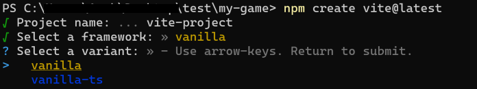
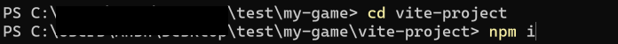
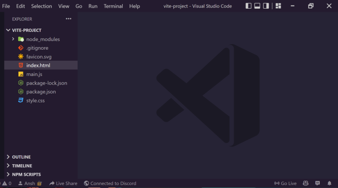

This Guide will help you get started with Neptune with Vite.
Follow along with the steps below to get started.

## Demo Project
### Download
This is a small test project to explore the framework. 
You can expand it to a full project according to your needs.

[**Sure, Download!**](../neptune-js-vite-example.zip)


### Install
* After downloading the zip file, extract it to your project folder.
* Open your terminal and navigate to the project folder.
* Run the following command to install all dependencies.

```bash
npm install
```
or
```bash
yarn
```

### Run

* After the command is finished running, 
you should see a folder called `node_modules` in your project folder. 
It means that all dependencies are installed.
* Run the following command to start the server.

```bash
npm run dev
```

or
```bash
yarn dev
```

* You should see a message in your terminal that says `Server is running at http://localhost:3000`.
* Open your browser and navigate to `http://localhost:3000`.


## Output
The output of this project should look like this.


## Custom Project
### Create Vite App
* Create a vite app using the following command.
```bash
  npm create vite@latest
```

* Give your project a name.


* Select the framework you want to use. (in this case vanilla)


* Use the vanilla framework for JavaScript.



* Let Vite finish.
Move inside your project folder.
and run the following command.
```bash
  npm i
```




* Now Install the Neptune.js from npm or yarn
```bash
  npm i @neptune-js/neptune
```
or
```bash
    yarn add @neptune-js/neptune
```


* Let npm/yarn finish
Open Visual Studio Code / Your IDE of choice.


* Project is ready to use.


* Open `index.html` file and add the following code.
```html
<!DOCTYPE html>
<html>
  <head>
    <title>My Neptune Game</title>
  </head>
  <body>  

    <!-- Game won't start until user clicks on the button -->
    <button id="__play__">Play</button>
    <!--The canvas where your game will be drawn -->
    <canvas id="__panel__"></canvas>
  
    <!--Link the game file into the html -->
    <script type="module" src="./main.js"></script>

  </body>
</html>
```

* Open the `main.js` file and add the following code.
```javascript
import * as npt from "@neptune-js/neptune"
class Game extends npt.Application{
    constructor(){
        super();
    }
    // Init is called only once when the Game starts, used for Initiating Code
    init(){
        super.init();
        this.background = new npt.Rect({
            app:this,
            pos: new npt.Vector2(0, 0),
            w: this.width,
            h: this.height,
            color: npt.Color.black
        });
        this.text = new npt.Text({
            app: this,
            parent: this.background, // property of an entity
            pos: new npt.Vector2(200,200),
            text: "Hello World",
            font: "30px Roboto", // all fonts which are supported by html5 canvas can be used here
            color: npt.Color.white,
            align: "center" // this is text align (similar to the html5 canvas) https://www.w3schools.com/tags/canvas_textalign.asp
        }); 
        this.text.align("center");
        this.text.align('middle');
    }
    
    // Update is called every frame, used to run logic and physics
    update(deltaTime){
        super.update(deltaTime);
    }
    
    // Draw method used to draw Renderables on the screen, draw is called just after update
    draw(ctx){
        super.draw(ctx);
    }
}
// Create a new Game
new Game();
```